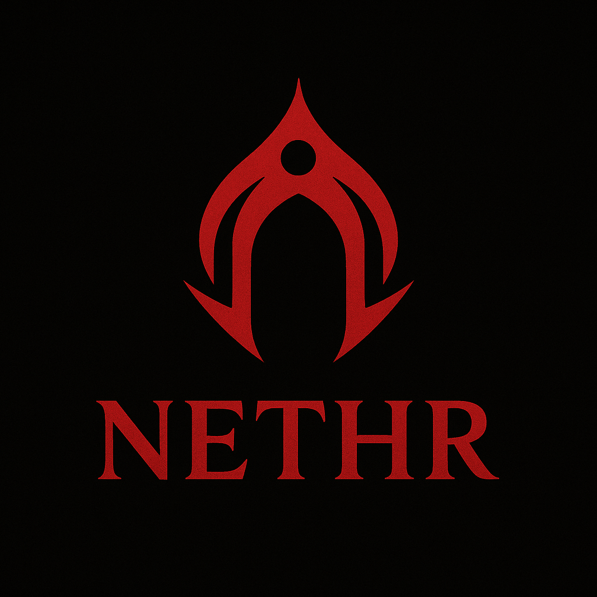

<h1 align="center">Nethr</h1>

<br>
<br>

<p align="center">
  <a href="https://github.com/MindsofD23b/Nethr" target="_blank">
    
  </a>
</p>

<br>
<br>

**Nethr.io** is your all-in-one platform for hosting and managing **Minecraft servers** - without the headaches.  
Spin up powerful, customizable servers in minutes, monitor their performance in real time, and keep full control right from your dashboard.

Whether you’re running a small survival world for friends or managing a large modded network, Nethr.io gives you the tools to do it your way:

- ⚡ **Instant setup:** Create and deploy servers in just a few clicks.
- 💾 **Smart resource control:** Adjust CPU, RAM, and player limits whenever you need.
- 📊 **Live insights:** Keep track of uptime, usage, and player activity with real-time monitoring.
- 💳 **Flexible plans:** From Budget to Premium - scale effortlessly as your world grows.
- 🔒 **Secure and reliable:** PCI-compliant payments, encrypted data, and stable cloud infrastructure.

```
In short, Nethr.io makes server management effortless, powerful, and fun - so you can focus on what really matters: playing, building, and creating with your community.
```
---

<br>
<br>

<p align="center">
  Central documentation hub for the entire Nethr ecosystem.<br>
  All concepts, technical plans, status reports and usage guides are collected and maintained here.
</p>

---

## 📁 Documentation Overview

Below you can find the main sections of our documentation.  
Each category links to its own folder or overview.

  <a href="https://github.com/MindsofD23b/docs/tree/main/StatusBerichte">
    Statusberichte
  </a>

<br>

  <a href="https://github.com/MindsofD23b/docs/tree/main/Konzepts">
    Konzepts
  </a>

<br>

  <a href="https://github.com/MindsofD23b/docs/tree/main/Usage">
    Usage
  </a>

<br>

 <a href="https://github.com/MindsofD23b/docs/tree/main/Guides">
    Usage
  </a>

---

## 📚 Sections Explained

### **📄 Statusberichte**
Regelmässige zweiwöchentliche Statusupdates des Projekts.  
Enthält Fortschritt, Risiken, offene Fragen und Planung.

### **🧩 Konzepte**
Alle Grundlagen, Ideen, Architekturentscheidungen & Projektbegründungen.  
Hier wird erklärt, **was Nethr ist**, **warum es existiert** und **wie es funktionieren soll**.

### **⚙️ Usage**
Da sind alle "Tools" die wir benutzt haben um die Webseite **[Nethr](https://github.com/MindsofD23b/Neithr)** zu kreieren mit Copy Right rechten.

<table align="">
  <tr>
    <td align="center">
      <br/>
      README
    </td>
    <td align="center">
      <br/>
      AWS
    </td>
    <td align="center">
      <br/>
      Docker
    </td>
    <td align="center">
      <br/>
      Figma
    </td>
    <td align="center">
      <br/>
      GitHub
    </td>
    <td align="center">
      <br/>
      React
    </td>
    <td align="center">
      <br/>
      Tailwind
    </td>
    <td align="center">
      <br/>
      Tools
    </td>
  </tr>
</table>


### **💡 Guides**
Guides, Tutorials und Erklärungen zur Nutzung von Nethr:

- Wie erstellt man einen Minecraft-Server?
- Wie funktioniert Live Monitoring?
- Wie skaliert man Ressourcen?
- Wie funktionieren die Tarife?
- API Doku (zukünftig)
- Deployment / Infrastruktur (AWS, Docker, etc.)


---

## 💬 Contribution & Team
- GitHub: **[Click me](https://github.com/MindsofD23b/)**  
- Collaborators werden aktiv gepflegt  
- Git wird sauber genutzt (Branches, PRs, Reviews)


## 👥 Contributors 

### 1. Jamie Poeffel (DevOps)

**Contribution:**  
Responsible for CI/CD pipelines, infrastructure automation, and deployment processes. Jamie ensured stable operations across development and production environments.

---

### 2. Kush Srigiri (Project Manager)

**Contribution:**  
Coordinated the team, handled sprint planning, and maintained communication between developers. Kush kept the project organized, prioritized tasks, and ensured deadlines were met.

---

### 3. Luis Allamand (Backend)

**Contribution:**  
Developed and maintained backend logic, API endpoints, and database integration. Luis focused on performance, security, and a clean, scalable server architecture.

---

### 4. Gregory Ruoss (Frontend)

**Contribution:**  
Implemented the user interface and ensured a smooth, responsive user experience. Gregory worked closely with the backend team to deliver seamless interaction between the UI and the API.

---

<p align="center">
  <a href="https://github.com/Jamie-Poeffel">
    
  </a>
  <a href="https://github.com/Kush-Srigiri">
    
  </a>
  <a href="https://github.com/LuisAll12">
    
  </a>
    <a href="https://github.com/GRuoss">
    
  </a>
</p>


---

## 🔗 Related Repositories

| Repo | Description |
|------|-------------|
| **[Nethr](https://github.com/MindsofD23b/Nethr)** | Main platform repository – core architecture, planning & meta resources. |
| **[Documentations](https://github.com/MindsofD23b/Documentations)** | Central documentation hub containing concepts, status reports, usage guides, and project planning. |
| **[Frontend](https://github.com/MindsofD23b/Frontend)** | React + Tailwind frontend for the Nethr dashboard, user interface, and server management UI. |
| **[Backend](https://github.com/MindsofD23b/Backend)** | API, server logic, authentication, billing integrations, monitoring endpoints, and infrastructure connections. |
| **[Service](https://github.com/MindsofD23b/Service)** | Background services: server deployment pipeline, resource scaling, monitoring workers & automation tasks. |


